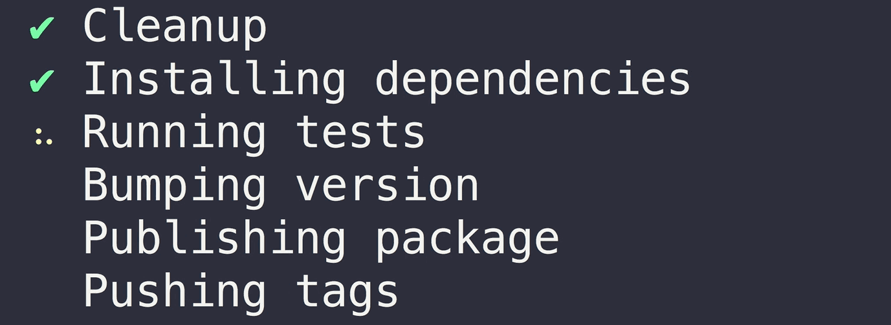
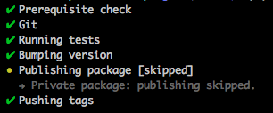

# np [](https://github.com/xojs/xo)

> A better `npm publish`

---

<div align="center">
	<p>
		<p>
			<sup>
				<a href="https://github.com/sponsors/sindresorhus">My open source work is supported by the community</a>
			</sup>
		</p>
		<sup>Special thanks to:</sup>
		<br>
		<br>
		<a href="https://forwardemail.net">
			
		</a>
	</p>
</div>

---



## Why

- [Interactive UI](#interactive-ui)
- Ensures you are publishing from your release branch (`main` and `master` by default)
- Ensures the working directory is clean and that there are no unpulled changes
- Reinstalls dependencies to ensure your project works with the latest dependency tree
- Ensures your Node.js and npm versions are supported by the project and its dependencies
- Runs the tests
- Bumps the version in package.json and npm-shrinkwrap.json (if present) and creates a git tag
- Prevents [accidental publishing](https://github.com/npm/npm/issues/13248) of pre-release versions under the `latest` [dist-tag](https://docs.npmjs.com/cli/dist-tag)
- Publishes the new version to npm, optionally under a dist-tag
- Rolls back the project to its previous state in case publishing fails
- Pushes commits and tags (newly & previously created) to GitHub/GitLab
- Supports [two-factor authentication](https://docs.npmjs.com/getting-started/using-two-factor-authentication)
- Enables two-factor authentication on new repositories
  <br>
  <sub>(does not apply to external registries)</sub>
- Opens a prefilled GitHub Releases draft after publish
- Warns about the possibility of extraneous files being published
- See exactly what will be executed with [preview mode](https://github.com/sindresorhus/np/issues/391), without pushing or publishing anything remotely
- Supports [GitHub Packages](https://github.com/features/packages)

### Why not

- Monorepos are not supported.
- Custom registries are not supported ([but could be with your help](https://github.com/sindresorhus/np/issues/420)).
- CI is [not an ideal environment](https://github.com/sindresorhus/np/issues/619#issuecomment-994493179) for `np`. It's meant to be used locally as an interactive tool.

## Prerequisite

- Node.js 10 or later
- npm 6.8.0 or later
- Git 2.11 or later

## Install

```sh
npm install --global np
```

## Usage

```
$ np --help

  Usage
    $ np <version>

    Version can be:
      patch | minor | major | prepatch | preminor | premajor | prerelease | 1.2.3

  Options
    --any-branch            Allow publishing from any branch
    --branch                Name of the release branch (default: main | master)
    --no-cleanup            Skips cleanup of node_modules
    --no-tests              Skips tests
    --yolo                  Skips cleanup and testing
    --no-publish            Skips publishing
    --preview               Show tasks without actually executing them
    --tag                   Publish under a given dist-tag
    --no-yarn               Don't use Yarn
    --contents              Subdirectory to publish
    --no-release-draft      Skips opening a GitHub release draft
    --release-draft-only    Only opens a GitHub release draft
    --test-script           Name of npm run script to run tests before publishing (default: test)
    --no-2fa                Don't enable 2FA on new packages (not recommended)
    --message               Version bump commit message. `%s` will be replaced with version. (default: '%s' with npm and 'v%s' with yarn)

  Examples
    $ np
    $ np patch
    $ np 1.0.2
    $ np 1.0.2-beta.3 --tag=beta
    $ np 1.0.2-beta.3 --tag=beta --contents=dist
```

## Interactive UI

Run `np` without arguments to launch the interactive UI that guides you through publishing a new version.


## Config

`np` can be configured both locally and globally. When using the global `np` binary, you can configure any of the CLI flags in either a `.np-config.js`, `.np-config.cjs` or `.np-config.json` file in the home directory. When using the local `np` binary, for example, in a `npm run` script, you can configure `np` by setting the flags in either a top-level `np` field in `package.json` or in a `.np-config.js`, `.np-config.cjs` or `.np-config.json` file in the project directory. If it exists, the local installation will always take precedence. This ensures any local config matches the version of `np` it was designed for.

Currently, these are the flags you can configure:

- `anyBranch` - Allow publishing from any branch (`false` by default).
- `branch` - Name of the release branch (`master` by default).
- `cleanup` - Cleanup `node_modules` (`true` by default).
- `tests` - Run `npm test` (`true` by default).
- `yolo` - Skip cleanup and testing (`false` by default).
- `publish` - Publish (`true` by default).
- `preview` - Show tasks without actually executing them (`false` by default).
- `tag` - Publish under a given dist-tag (`latest` by default).
- `yarn` - Use yarn if possible (`true` by default).
- `contents` - Subdirectory to publish (`.` by default).
- `releaseDraft` - Open a GitHub release draft after releasing (`true` by default).
- `testScript` - Name of npm run script to run tests before publishing (`test` by default).
- `2fa` - Enable 2FA on new packages (`true` by default) (setting this to `false` is not recommended).
- `message` - The commit message used for the version bump. Any `%s` in the string will be replaced with the new version. By default, npm uses `%s` and Yarn uses `v%s`.

For example, this configures `np` to never use Yarn and to use `dist` as the subdirectory to publish:

`package.json`
```json
{
	"name": "superb-package",
	"np": {
		"yarn": false,
		"contents": "dist"
	}
}
```

`.np-config.json`
```json
{
	"yarn": false,
	"contents": "dist"
}
```

`.np-config.js` or `.np-config.cjs`
```js
module.exports = {
	yarn: false,
	contents: 'dist'
};
```

_**Note:** The global config only applies when using the global `np` binary, and is never inherited when using a local binary._

## Tips

### npm hooks

You can use any of the test/version/publish related [npm lifecycle hooks](https://docs.npmjs.com/misc/scripts) in your package.json to add extra behavior.

For example, here we build the documentation before tagging the release:

```json
{
	"name": "my-awesome-package",
	"scripts": {
		"version": "./build-docs && git add docs"
	}
}
```

### Release script

You can also add `np` to a custom script in `package.json`. This can be useful if you want all maintainers of a package to release the same way (Not forgetting to push Git tags, for example). However, you can't use `publish` as name of your script because it's an [npm defined lifecycle hook](https://docs.npmjs.com/misc/scripts).

```json
{
	"name": "my-awesome-package",
	"scripts": {
		"release": "np"
	},
	"devDependencies": {
		"np": "*"
	}
}
```

### User-defined tests

If you want to run a user-defined test script before publishing instead of the normal `npm test` or `yarn test`, you can use `--test-script` flag or the `testScript` config. This can be useful when your normal test script is running with a `--watch` flag or in case you want to run some specific tests (maybe on the packaged files) before publishing.

For example, `np --test-script=publish-test` would run the `publish-test` script instead of the default `test`.

```json
{
	"name": "my-awesome-package",
	"scripts": {
		"test": "ava --watch",
		"publish-test": "ava"
	},
	"devDependencies": {
		"np": "*"
	}
}
```

### Signed Git tag

Set the [`sign-git-tag`](https://docs.npmjs.com/misc/config#sign-git-tag) npm config to have the Git tag signed:

```
$ npm config set sign-git-tag true
```

Or set the [`version-sign-git-tag`](https://yarnpkg.com/lang/en/docs/cli/version/#toc-git-tags) Yarn config:

```
$ yarn config set version-sign-git-tag true
```

### Private packages



You can use `np` for packages that aren't publicly published to npm (perhaps installed from a private git repo).

Set `"private": true` in your `package.json` and the publishing step will be skipped. All other steps
including versioning and pushing tags will still be completed.

### Public scoped packages

To publish [scoped packages](https://docs.npmjs.com/misc/scope#publishing-public-scoped-packages-to-the-public-npm-registry) to the public registry, you need to set the access level to `public`. You can do that by adding the following to your `package.json`:

```json
"publishConfig": {
	"access": "public"
}
```

If publishing a scoped package for the first time, `np` will prompt you to ask if you want to publish it publicly.

### Private Org-scoped packages

To publish a [private Org-scoped package](https://docs.npmjs.com/creating-and-publishing-an-org-scoped-package#publishing-a-private-org-scoped-package), you need to set the access level to `restricted`. You can do that by adding the following to your `package.json`:

```json
"publishConfig": {
	"access": "restricted"
}
```

### Publish to a custom registry

Set the [`registry` option](https://docs.npmjs.com/misc/config#registry) in package.json to the URL of your registry:

```json
"publishConfig": {
	"registry": "https://my-internal-registry.local"
}
```

### Publish with a CI

If you use a Continuous Integration server to publish your tagged commits, use the `--no-publish` flag to skip the publishing step of `np`.

### Publish to gh-pages

To publish to `gh-pages` (or any other branch that serves your static assets), install [`branchsite`](https://github.com/enriquecaballero/branchsite), an `np`-like CLI tool aimed to complement `np`, and create an [npm "post" hook](https://docs.npmjs.com/misc/scripts) that runs after `np`.

```
$ npm install --save-dev branchsite
```

```json
"scripts": {
	"deploy": "np",
	"postdeploy": "bs"
}
```

### Initial version

For new packages, start the `version` field in package.json at `0.0.0` and let `np` bump it to `1.0.0` or `0.1.0` when publishing.

### Release an update to an old major version

To release a minor/patch version for an old major version, create a branch from the major version's git tag and run `np`:

```console
$ git checkout -b fix-old-bug v1.0.0 # Where 1.0.0 is the previous major version
# Create some commits…
$ git push --set-upstream origin HEAD
$ np patch --any-branch --tag=v1
```

### The prerequisite step runs forever on macOS

If you're using macOS Sierra 10.12.2 or later, your SSH key passphrase is no longer stored into the keychain by default. This may cause the `prerequisite` step to run forever because it prompts for your passphrase in the background. To fix this, add the following lines to your `~/.ssh/config` and run a simple Git command like `git fetch`.

```
Host *
 AddKeysToAgent yes
 UseKeychain yes
```

If you're running into other issues when using SSH, please consult [GitHub's support article](https://help.github.com/articles/connecting-to-github-with-ssh/).

### Ignore strategy

The [ignore strategy](https://docs.npmjs.com/files/package.json#files), either maintained in the `files`-property in `package.json` or in `.npmignore`, is meant to help reduce the package size. To avoid broken packages caused by essential files being accidentally ignored, `np` prints out all the new and unpublished files added to Git. Test files and other [common files](https://docs.npmjs.com/files/package.json#files) that are never published are not considered. `np` assumes either a standard directory layout or a customized layout represented in the `directories` property in `package.json`.

## FAQ

### I get an error when publishing my package through Yarn

If you get an error like this…

```shell
❯ Prerequisite check
✔ Ping npm registry
✔ Check npm version
✔ Check yarn version
✖ Verify user is authenticated

npm ERR! code E403
npm ERR! 403 Forbidden - GET https://registry.yarnpkg.com/-/package/my-awesome-package/collaborators?format=cli - Forbidden
```

…please check whether the command `npm access ls-collaborators my-awesome-package` succeeds. If it doesn't, Yarn has overwritten your registry URL. To fix this, add the correct registry URL to `package.json`:

```json
"publishConfig": {
	"registry": "https://registry.npmjs.org"
}
```

## Maintainers

- [Sindre Sorhus](https://github.com/sindresorhus)
- [Sam Verschueren](https://github.com/SamVerschueren)
- [Itai Steinherz](https://github.com/itaisteinherz)
